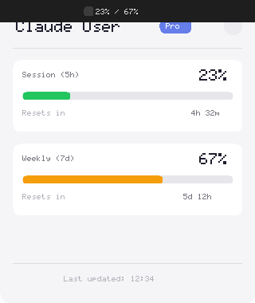

# Claude Bar

<p align="center">
  
  
  
</p>

<p align="center">
  <strong>Monitor your Claude Code quotas directly from the macOS menu bar.</strong>
</p>

<p align="center">
  
</p>

---

## Features

### Core
- **Menu Bar Display** — Shows your current quota usage right in the menu bar
- **Detailed Popup** — Click to see session (5h) and weekly (7d) quotas with progress bars
- **Smart Color Coding** — Progress bars change from green → orange → red as usage increases
- **Auto Refresh** — Configurable refresh interval (30s to 10min)
- **Dark Mode** — Seamlessly adapts to your macOS appearance
- **Lightweight** — Runs quietly in the background with minimal resource usage
- **Native Feel** — Uses macOS vibrancy effects for a native look

### Display Modes
Choose your preferred menu bar format (right-click → Display Mode):
- **Standard**: `45% / 32%`
- **Detailed**: `5h: 45% | 7d: 32%`
- **Compact**: `45%` (shows highest usage only)

### Usage Statistics
- Track quota usage over time with persistent storage
- 24-hour statistics: average and peak values

### Notifications
- Warning alert at 70% utilization
- Critical alert at 90% utilization
- Quota reset notifications
- Token refresh failure alerts
- Toggle on/off in Settings

### Auto-Updates
- Automatic update checks on startup
- Background download of updates
- One-click install from Settings

## Requirements

- macOS 10.13 or later
- [Claude Code CLI](https://claude.ai/claude-code) installed and authenticated

## Installation

### From DMG (Recommended)

1. Download the latest DMG from [Releases](https://github.com/TheFugu/claude-bar/releases):
   - **Apple Silicon (M1/M2/M3):** `Claude.Bar-x.x.x-arm64.dmg`
   - **Intel:** `Claude.Bar-x.x.x-x64.dmg`
2. Open the DMG and drag **Claude Bar** to your Applications folder
3. **Important (Apple Silicon):** The app is not notarized. Before first launch, run:
   ```bash
   xattr -cr /Applications/Claude\ Bar.app
   codesign --force --deep --sign - /Applications/Claude\ Bar.app
   ```
4. Launch Claude Bar from Applications

### From Source

```bash
# Clone the repository
git clone https://github.com/TheFugu/claude-bar.git
cd claude-bar

# Install dependencies
npm install

# Run in development mode
npm run dev

# Or build the DMG
npm run dist
```

## Setup

Before using Claude Bar, you need to authenticate with Claude Code CLI:

```bash
claude login
```

Claude Bar reads the OAuth credentials stored by Claude Code in the macOS Keychain. No additional configuration needed!

## Usage

| Action | Result |
|--------|--------|
| **Left-click** on menu bar icon | Opens quota popup and refreshes data |
| **Right-click** on menu bar icon | Shows context menu (Refresh, Settings, Quit) |

### Menu Bar Display

The menu bar shows two percentages:
- **First number**: Session quota (5-hour rolling window)
- **Second number**: Weekly quota (7-day rolling window)

### Quota Levels

| Usage | Color | Meaning |
|-------|-------|---------|
| 0-69% | 🟢 Green | Normal usage |
| 70-89% | 🟠 Orange | Approaching limit |
| 90-100% | 🔴 Red | Near or at limit |

### Settings

Access settings via right-click → Settings:

- **Refresh Interval**: How often to fetch new quota data (30s - 10min)
- **Launch at Login**: Automatically start Claude Bar when you log in
- **Notifications**: Enable/disable system notifications for quota alerts
- **Updates**: Check for updates and install with one click

## How It Works

Claude Bar uses the same OAuth credentials as Claude Code CLI, stored securely in the macOS Keychain under `Claude Code-credentials`. It periodically calls the Anthropic API to fetch your current usage:

```
GET https://api.anthropic.com/api/oauth/usage
```

No API keys or manual configuration required — if you're logged into Claude Code, you're ready to go!

### Token Management

Claude Bar automatically handles token refresh:
- Detects expired OAuth tokens
- Refreshes tokens using the refresh token
- Updates the Keychain with new credentials
- Graceful fallback if refresh fails

### Security

- **Context Isolation**: Renderer cannot access Node.js
- **Preload Bridge**: All IPC via secure contextBridge
- **Keychain Storage**: Credentials stored in macOS Keychain
- **Signed Updates**: Auto-updates are signed and verified

## Development

```bash
# Install dependencies
npm install

# Start development server with hot reload
npm run dev

# Build for production
npm run build

# Create distributable DMG
npm run dist
```

### Project Structure

```
claude-bar/
├── src/
│   ├── main/           # Electron main process
│   │   ├── services/   # Keychain, API, Scheduler, History, Notifications, Updater
│   │   ├── tray.ts     # Menu bar icon management
│   │   └── windows.ts  # Popup & Settings windows
│   ├── preload/        # Secure IPC bridge
│   └── renderer/       # UI (popup & settings)
├── tests/              # Vitest unit tests
├── assets/             # Icons
└── scripts/            # Icon generation scripts
```

### Running Tests

```bash
npm run test           # Run all tests
npm run test:watch     # Run tests in watch mode
npm run test:coverage  # Run tests with coverage report
```

## Troubleshooting

### "Not Connected" message

Make sure you're authenticated with Claude Code CLI:
```bash
claude login
```
Then restart Claude Bar.

### Quota not updating

Try right-clicking the menu bar icon and selecting "Refresh". If the issue persists, check your internet connection.

### "Cannot open application" error

On Apple Silicon Macs, you may see this error because the app is not notarized. Run these commands in Terminal:
```bash
xattr -cr /Applications/Claude\ Bar.app
codesign --force --deep --sign - /Applications/Claude\ Bar.app
```
Then try opening the app again.

### App not starting

If the app fails to start, try removing it from Login Items and re-adding it through Settings.

## License

MIT License — see [LICENSE](LICENSE) for details.

## Acknowledgments

- Built with [Electron](https://www.electronjs.org/) and [electron-vite](https://electron-vite.org/)
- Inspired by the need to keep an eye on Claude Code usage without interrupting workflow

---

<p align="center">
  Made with ❤️ for Claude Code users
</p>
